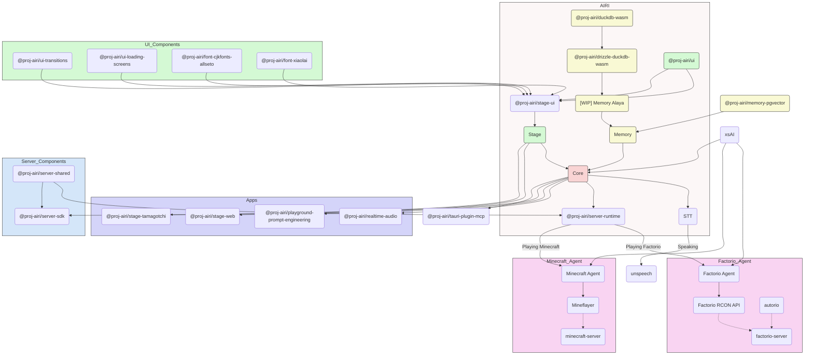

<picture>
  <source
    width="100%"
    srcset="./docs/content/public/banner-dark-1280x640.avif"
    media="(prefers-color-scheme: dark)"
  />
  <source
    width="100%"
    srcset="./docs/content/public/banner-light-1280x640.avif"
    media="(prefers-color-scheme: light), (prefers-color-scheme: no-preference)"
  />
  
</picture>

<h1 align="center">Project AIRI</h1>

<p align="center">Neuro-sama を再現する — AIワイフ / バーチャルキャラクターの魂の器を作り、彼女たちを私たちの世界に連れてくるプロジェクト。</p>

<p align="center">
  [<a href="https://discord.gg/TgQ3Cu2F7A">Discordサーバーに参加</a>] [<a href="https://airi.moeru.ai">試してみる</a>]
</p>

<p align="center">
  <a href="https://deepwiki.com/moeru-ai/airi"></a>
  <a href="https://github.com/moeru-ai/airi/blob/main/LICENSE"></a>
  <a href="https://discord.gg/TgQ3Cu2F7A"></a>
  <a href="https://x.com/proj_airi"></a>
  <a href="https://t.me/+7M_ZKO3zUHFlOThh"></a>
  <a href="./docs/wechat.md"></a>
  <a href="https://qun.qq.com/universal-share/share?ac=1&authKey=9g00d%2BZS7nORzcJugNNddJ7rCghZTIR7fhXabGwch2S%2BG%2BKGIKwlN1N2nIqkh2jg&busi_data=eyJncm91cENvZGUiOiIxMDU4MTU2Njk3IiwidG9rZW4iOiJmcnkra1hWNFIxNytEcG0zcHRUdVJIaldlRDFxN0dzK080QWtvTEdOQjJkNEY2eUFta1g1clNpbkxSMS9FQWFYIiwidWluIjoiMTI2MDkwNzMzNSJ9&data=b1eJrwn3GVOUh7YIxZ7l9vHQo99HPmRxKPpMKlDCmfzx8Y57IXb2EZCMaOC9rVTd2U558qpNjwUYUWlPHxVHvg&svctype=4&tempid=h5_group_info"></a>
</p>

<p float="left" align="center">
  <!-- readme-section:release-binary-windows -->
  <a href="https://github.com/moeru-ai/airi/releases/download/v0.9.0-alpha.18/AIRI-0.9.0-alpha.18-windows-x64-setup.exe">
    <picture>
      <source
        width="33%"
        srcset="./docs/content/public/assets/download-buttons/download-buttons.windows.dark.en-US.avif"
        media="(prefers-color-scheme: dark)"
      />
      <source
        width="33%"
        srcset="./docs/content/public/assets/download-buttons/download-buttons.windows.light.en-US.avif"
        media="(prefers-color-scheme: light), (prefers-color-scheme: no-preference)"
      />
      
    </picture>
  </a>
  <!-- readme-section:release-binary-macos -->
  <a href="https://github.com/moeru-ai/airi/releases/download/v0.9.0-alpha.18/AIRI-0.9.0-alpha.18-darwin-arm64.dmg">
    <picture>
      <source
        width="33%"
        srcset="./docs/content/public/assets/download-buttons/download-buttons.macos.dark.en-US.avif"
        media="(prefers-color-scheme: dark)"
      />
      <source
        width="33%"
        srcset="./docs/content/public/assets/download-buttons/download-buttons.macos.light.en-US.avif"
        media="(prefers-color-scheme: light), (prefers-color-scheme: no-preference)"
      />
      
    </picture>
  </a>
  <a href="https://github.com/moeru-ai/airi/releases/latest">
    <picture>
      <source
        width="33%"
        srcset="./docs/content/public/assets/download-buttons/download-buttons.linux.dark.en-US.avif"
        media="(prefers-color-scheme: dark)"
      />
      <source
        width="33%"
        srcset="./docs/content/public/assets/download-buttons/download-buttons.linux.light.en-US.avif"
        media="(prefers-color-scheme: light), (prefers-color-scheme: no-preference)"
      />
      
    </picture>
  </a>
</p>

<p float="left" align="center">
  <a href="https://airi.moeru.ai">
    <picture>
      <source
        width="33%"
        srcset="./docs/content/public/assets/QR%20code%20button/section.cards.qrcode.dark.en-US.png"
        media="(prefers-color-scheme: dark)"
      />
      <source
        width="33%"
        srcset="./docs/content/public/assets/QR%20code%20button/section.cards.qrcode.light.en-US.png"
        media="(prefers-color-scheme: light), (prefers-color-scheme: no-preference)"
      />
      
    </picture>
  </a>
  <a href="https://airi.moeru.ai">
    <picture>
      <source
        width="33%"
        srcset="./docs/content/public/assets/download-buttons/download-buttons.mobile.dark.en-US.avif"
        media="(prefers-color-scheme: dark)"
      />
      <source
        width="33%"
        srcset="./docs/content/public/assets/download-buttons/download-buttons.mobile.light.en-US.avif"
        media="(prefers-color-scheme: light), (prefers-color-scheme: no-preference)"
      />
      
    </picture>
  </a>
  <a href="https://airi.moeru.ai">
    <picture>
      <source
        width="33%"
        srcset="./docs/content/public/assets/download-buttons/download-buttons.browser.dark.en-US.png"
        media="(prefers-color-scheme: dark)"
      />
      <source
        width="33%"
        srcset="./docs/content/public/assets/download-buttons/download-buttons.browser.light.en-US.png"
        media="(prefers-color-scheme: light), (prefers-color-scheme: no-preference)"
      />
      
    </picture>
  </a>
</p>

<p align="center">
  <a href="https://www.producthunt.com/products/airi?embed=true&utm_source=badge-featured&utm_medium=badge&utm_source=badge-airi" target="_blank"></a>
  <a href="https://trendshift.io/repositories/14636" target="_blank"></a>
</p>

> [Neuro-sama](https://www.youtube.com/@Neurosama) に強くインスパイアされています

> [!TIP]
> Windowsでは [Scoop](https://scoop.sh/) でもインストールできます：
>
> ```powershell
> scoop bucket add airi https://github.com/moeru-ai/airi
> scoop install airi/airi
> ```

> [!WARNING]
> **注意:** 本プロジェクトに関連する公式の暗号通貨やトークンは **一切存在しません**。情報を確認の上、ご注意ください。

> [!NOTE]
>
> Project AIRIから生まれたサブプロジェクト専用のGitHub Organization [@proj-airi](https://github.com/proj-airi) があります。ぜひチェックしてください！
>
> RAG、メモリシステム、組み込みデータベース、アイコン、Live2Dユーティリティなど！

> [!TIP]
> [Crowdin](https://crowdin.com/project/proj-airi) で翻訳プロジェクトを公開しています。翻訳の改善にぜひご協力ください。
> <a href="https://crowdin.com/project/proj-airi" target="_blank" rel="nofollow"></a>

サイバーリビング（サイバーワイフ、デジタルペット）やデジタルコンパニオンが、あなたと一緒に遊んだり話したりしてくれたら——そんな夢を見たことはありませんか？

[ChatGPT](https://chatgpt.com) や [Claude](https://claude.ai) といった最新の大規模言語モデルの力により、バーチャルキャラクターにロールプレイやチャットをさせることは誰でも簡単にできるようになりました。[Character.ai](https://character.ai) や [JanitorAI](https://janitorai.com/) などのプラットフォーム、ローカル環境の [SillyTavern](https://github.com/SillyTavern/SillyTavern) は、チャットベースやビジュアルアドベンチャー的な体験には十分なソリューションです。

> でも、ゲームで遊ぶ能力は？ あなたがコーディングしている内容を見る能力は？ ゲームをしながらチャットしたり、動画を見たり、他にも色々できる能力は？

おそらく [Neuro-sama](https://www.youtube.com/@Neurosama) をご存知でしょう。彼女はゲームプレイ、チャット、視聴者との交流が可能な現在最高のバーチャルストリーマーです。**残念ながらオープンソースではないため、ライブ配信が終わると彼女と交流することはできません。**

そこで本プロジェクト AIRI は、もう一つの可能性を提供します：**あなたのデジタルライフを、いつでも、どこでも、簡単に**。

## 開発ログ＆最新アップデート

- [DevLog @ 2026.03.14](https://airi.moeru.ai/docs/en/blog/DevLog-2026.03.14/) on March 14, 2026
- [DevLog @ 2026.02.16](https://airi.moeru.ai/docs/en/blog/DevLog-2026.02.16/) on February 16, 2026
- [DevLog @ 2026.01.01](https://airi.moeru.ai/docs/en/blog/DevLog-2026.01.01/) on January 1, 2026
- [DevLog @ 2025.10.20](https://airi.moeru.ai/docs/en/blog/DevLog-2025.10.20/) on October 20, 2025
- [DevLog @ 2025.08.05](https://airi.moeru.ai/docs/en/blog/DevLog-2025.08.05/) on August 5, 2025
- [DevLog @ 2025.08.01](https://airi.moeru.ai/docs/en/blog/DevLog-2025.08.01/) on August 1, 2025
- [DreamLog 0x1](https://airi.moeru.ai/docs/en/blog/dreamlog-0x1/) on June 16, 2025
- ...続きは[ドキュメントサイト](https://airi.moeru.ai/docs/en/)にて

## このプロジェクトの特徴

他のAI駆動VTuberオープンソースプロジェクトとは異なり、アイリは初日から [WebGPU](https://www.w3.org/TR/webgpu/)、[WebAudio](https://developer.mozilla.org/en-US/docs/Web/API/Web_Audio_API)、[Web Workers](https://developer.mozilla.org/en-US/docs/Web/API/Web_Workers_API/Using_web_workers)、[WebAssembly](https://webassembly.org/)、[WebSocket](https://developer.mozilla.org/en-US/docs/Web/API/WebSocket) など多くのWeb技術をサポートして構築されています。

> [!TIP]
> Web技術を使っているからパフォーマンスが落ちるのでは？と心配していますか？
>
> ご安心ください。Webブラウザ版はブラウザやWebView内でどこまでできるかを示すためのものです。デスクトップ版のAIRIは、標準で [NVIDIA CUDA](https://developer.nvidia.com/cuda-toolkit) や [Apple Metal](https://developer.apple.com/metal/) をネイティブに使用できます（HuggingFace と [candle](https://github.com/huggingface/candle) プロジェクトのおかげです）。複雑な依存関係管理は不要で、グラフィックス、レイアウト、アニメーション、WIPのプラグインシステムには部分的にWeb技術を活用しています。

つまり、**アイリは最新のブラウザやデバイス上で動作可能**であり、モバイルデバイスでも動作します（PWAサポート済み）。これにより、開発者にとってはアイリ VTuberの機能を次のレベルに拡張できる多くの可能性が生まれ、ユーザーにとってはDiscordボイスチャンネルへの接続やMinecraft・Factorioでの協力プレイなど、TCP接続等の非Web技術が必要な機能も柔軟に利用できます。

> [!NOTE]
>
> 現在まだ開発の初期段階であり、アイリを実現するために才能ある開発者を募集しています。
>
> Vue.js、TypeScript、このプロジェクトに必要な開発ツールに詳しくなくても大丈夫です。アーティスト、デザイナーとして参加したり、初めてのライブ配信のお手伝いをすることもできます。
>
> React、Svelte、Solidのファンでも歓迎します。サブディレクトリを作って、アイリに欲しい機能を追加したり、実験したりできます。
>
> 募集中の分野（関連プロジェクト）：
>
> - Live2Dモデラー
> - VRMモデラー
> - VRChatアバターデザイナー
> - コンピュータビジョン
> - 強化学習
> - 音声認識
> - 音声合成
> - ONNX Runtime
> - Transformers.js
> - vLLM
> - WebGPU
> - Three.js
> - WebXR（@moeru-ai organization の[別プロジェクト](https://github.com/moeru-ai/chat)もチェック）
>
> **興味がある方はこちらで自己紹介してみませんか？ [AIRIの開発に参加しませんか？](https://github.com/moeru-ai/airi/discussions/33)**

## 現在の進捗

実装済みの機能

- [x] 脳（Brain）
  - [x] [Minecraft](https://www.minecraft.net) をプレイ
  - [x] [Factorio](https://www.factorio.com) をプレイ（WIP、[PoCとデモあり](https://github.com/moeru-ai/airi-factorio)）
  - [x] [Kerbal Space Program](https://www.kerbalspaceprogram.com/) をプレイ（発表予定）
  - [ ] [Helldivers 2](https://www.playstation.com/en-hk/games/helldivers-2/pc/) を協力プレイ（WIP）
  - [x] [Telegram](https://telegram.org) でチャット
  - [x] [Discord](https://discord.com) でチャット
  - [x] ウェブ検索（Google / Bing / DuckDuckGo）
  - [x] ブラウザ自律操作（Chrome拡張機能経由）
  - [ ] メモリ
    - [x] ブラウザ内データベースサポート（DuckDB WASM | `pglite`）
    - [ ] Memory Alaya（WIP）
  - [ ] ブラウザ内ローカル（WebGPU）推論
- [x] 耳（Ears）
  - [x] ブラウザからの音声入力
  - [x] [Discord](https://discord.com) からの音声入力
  - [x] クライアント側音声認識
  - [x] クライアント側発話検出
- [x] 口（Mouth）
  - [x] [ElevenLabs](https://elevenlabs.io/) 音声合成
- [x] 体（Body）
  - [x] VRMサポート
    - [x] VRMモデルの制御
  - [x] VRMモデルアニメーション
    - [x] オートまばたき
    - [x] オート視線追従
    - [x] アイドル時の目の動き
  - [x] Live2Dサポート
    - [x] Live2Dモデルの制御
  - [x] Live2Dモデルアニメーション
    - [x] オートまばたき
    - [x] オート視線追従
    - [x] アイドル時の目の動き

## 開発

> 詳細な開発手順は [CONTRIBUTING.md](./.github/CONTRIBUTING.md) を参照してください。

> [!NOTE]
> デフォルトでは `pnpm dev` でStage Web（ブラウザ版）の開発サーバーが起動します。
> デスクトップ版の開発を試す場合は、[CONTRIBUTING.md](./.github/CONTRIBUTING.md) を読んで環境を正しくセットアップしてください。

```shell
pnpm i
pnpm dev
```

### Stage Web（ブラウザ版 [airi.moeru.ai](https://airi.moeru.ai)）

```shell
pnpm dev
```

### Stage Tamagotchi（デスクトップ版）

```shell
pnpm dev:tamagotchi
```

Tamagotchi用のNixパッケージも含まれています。Nixで実行するには、flakesを有効にしてから以下を実行：

```shell
nix run github:moeru-ai/airi
```

#### NixOS

ElectronはNixOSの標準パスに存在しない共有ライブラリを必要とします。`flake.nix` で定義されたFHSシェルを使用してください：

```shell
nix develop .#fhs
pnpm dev:tamagotchi
```

### Stage Pocket（モバイル版）

Capacitorの開発サーバーを起動：

```shell
pnpm dev:pocket:ios --target <DEVICE_ID_OR_SIMULATOR_NAME>
# Or
CAPACITOR_DEVICE_ID=<DEVICE_ID_OR_SIMULATOR_NAME> pnpm dev:pocket:ios
```

`pnpm exec cap run ios --list` で利用可能なデバイスやシミュレータの一覧を確認できます。

Pocketでワイヤレスモードのサーバーチャンネルに接続する場合は、root権限でtamagotchiを起動する必要があります：

```shell
sudo pnpm dev:tamagotchi
```

その後、tamagotchiの `settings/connections` でセキュアWebSocketを有効にしてください。

### ドキュメントサイト

```shell
pnpm dev:docs
```

### ブラウザ検索機能（Chrome拡張機能 + ブリッジサーバー）

AIRIがウェブ検索やブラウザ操作を行うための機能です。3つのコンポーネントで構成されています：

1. **ブリッジサーバー起動**（AIRI フロントエンドとChrome拡張機能の橋渡し）

```shell
node browser-bridge/server.mjs
# または
start-bridge-server.bat
```

2. **Chrome拡張機能をインストール**
   - Chromeで `chrome://extensions` を開く
   - 「デベロッパーモード」を有効にする
   - 「パッケージ化されていない拡張機能を読み込む」→ `browser-bridge/` フォルダを選択

3. **AIRI Web UIを起動** — チャットでAIに検索を依頼すると、自動的にブラウザ経由で検索・情報取得を行います

### リリース

`bumpp` 実行後に `Cargo.toml` のバージョンも更新してください：

```shell
npx bumpp --no-commit --no-tag
```

## 対応LLM APIプロバイダー（[xsai](https://github.com/moeru-ai/xsai) により提供）

- [x] [AIHubMix (recommended)](https://aihubmix.com/?aff=OOiX)
- [x] [OpenRouter](https://openrouter.ai/)
- [x] [vLLM](https://github.com/vllm-project/vllm)
- [x] [SGLang](https://github.com/sgl-project/sglang)
- [x] [Ollama](https://github.com/ollama/ollama)
- [x] [LM Studio](https://lmstudio.ai/)
- [x] [302.AI (sponsored)](https://share.302.ai/514k2v)
- [x] [OpenAI](https://platform.openai.com/docs/guides/gpt/chat-completions-api)
  - [ ] [Azure OpenAI API](https://learn.microsoft.com/en-us/azure/ai-services/openai/reference) (PR welcome)
- [x] [Anthropic Claude](https://anthropic.com)
  - [ ] [AWS Claude](https://docs.anthropic.com/en/api/claude-on-amazon-bedrock) (PR welcome)
- [x] [DeepSeek](https://www.deepseek.com/)
- [x] [Qwen](https://help.aliyun.com/document_detail/2400395.html)
- [x] [Google Gemini](https://developers.generativeai.google)
- [x] [xAI](https://x.ai/)
- [x] [Groq](https://wow.groq.com/)
- [x] [Mistral](https://mistral.ai/)
- [x] [Cloudflare Workers AI](https://developers.cloudflare.com/workers-ai/)
- [x] [Together.ai](https://www.together.ai/)
- [x] [Fireworks.ai](https://www.together.ai/)
- [x] [Novita](https://www.novita.ai/)
- [x] [Zhipu](https://bigmodel.cn)
- [x] [SiliconFlow](https://cloud.siliconflow.cn/i/rKXmRobW)
- [x] [Stepfun](https://platform.stepfun.com/)
- [x] [Baichuan](https://platform.baichuan-ai.com)
- [x] [Minimax](https://api.minimax.chat/)
- [x] [Moonshot AI](https://platform.moonshot.cn/)
- [x] [ModelScope](https://modelscope.cn/docs/model-service/API-Inference/intro)
- [x] [Player2](https://player2.game/)
- [x] [Tencent Cloud](https://cloud.tencent.com/document/product/1729)
- [ ] [Sparks](https://www.xfyun.cn/doc/spark/Web.html) (PR welcome)
- [ ] [Volcano Engine](https://www.volcengine.com/experience/ark?utm_term=202502dsinvite&ac=DSASUQY5&rc=2QXCA1VI) (PR welcome)

## このプロジェクトから生まれたサブプロジェクト

- [Awesome AI VTuber](https://github.com/proj-airi/awesome-ai-vtuber): A curated list of AI VTubers and related projects
- [`unspeech`](https://github.com/moeru-ai/unspeech): Universal endpoint proxy server for `/audio/transcriptions` and `/audio/speech`, like LiteLLM but for any ASR and TTS
- [`hfup`](https://github.com/moeru-ai/hfup): tools to help on deploying, bundling to HuggingFace Spaces
- [`xsai-transformers`](https://github.com/moeru-ai/xsai-transformers): Experimental [🤗 Transformers.js](https://github.com/huggingface/transformers.js) provider for [xsAI](https://github.com/moeru-ai/xsai).
- [WebAI: Realtime Voice Chat](https://github.com/proj-airi/webai-realtime-voice-chat): Full example of implementing ChatGPT's realtime voice from scratch with VAD + STT + LLM + TTS.
- [`@proj-airi/drizzle-duckdb-wasm`](https://github.com/moeru-ai/airi/tree/main/packages/drizzle-duckdb-wasm/README.md): Drizzle ORM driver for DuckDB WASM
- [`@proj-airi/duckdb-wasm`](https://github.com/moeru-ai/airi/tree/main/packages/duckdb-wasm/README.md): Easy to use wrapper for `@duckdb/duckdb-wasm`
- [`tauri-plugin-mcp`](https://github.com/moeru-ai/airi/blob/main/crates/tauri-plugin-mcp/README.md): A Tauri plugin for interacting with MCP servers.
- [AIRI Factorio](https://github.com/moeru-ai/airi-factorio): Allow AIRI to play Factorio.
- [AIRI DomeKeeper](https://github.com/proj-airi/game-playing-ai-dome-keeper): Allow AIRI to play DomeKeeper.
- [Factorio RCON API](https://github.com/nekomeowww/factorio-rcon-api): RESTful API wrapper for Factorio headless server console
- [`autorio`](https://github.com/moeru-ai/airi-factorio/tree/main/packages/autorio): Factorio automation library
- [`tstl-plugin-reload-factorio-mod`](https://github.com/moeru-ai/airi-factorio/tree/main/packages/tstl-plugin-reload-factorio-mod): Reload Factorio mod when developing
- [Velin](https://github.com/luoling8192/velin): Use Vue SFC and Markdown to write easy to manage stateful prompts for LLM
- [`demodel`](https://github.com/moeru-ai/demodel): Easily boost the speed of pulling your models and datasets from various of inference runtimes.
- [`inventory`](https://github.com/moeru-ai/inventory): Centralized model catalog and default provider configurations backend service
- [MCP Launcher](https://github.com/moeru-ai/mcp-launcher): Easy to use MCP builder & launcher for all possible MCP servers, just like Ollama for models!
- [🥺 SAD](https://github.com/moeru-ai/sad): Documentation and notes for self-host and browser running LLMs.



## 類似プロジェクト

### オープンソース

- [kimjammer/Neuro: A recreation of Neuro-Sama originally created in 7 days.](https://github.com/kimjammer/Neuro): very well completed implementation.
- [SugarcaneDefender/z-waif](https://github.com/SugarcaneDefender/z-waif): Great at gaming, autonomous, and prompt engineering
- [semperai/amica](https://github.com/semperai/amica/): Great at VRM, WebXR
- [elizaOS/eliza](https://github.com/elizaOS/eliza): Great examples and software engineering on how to integrate agent into various of systems and APIs
- [ardha27/AI-Waifu-Vtuber](https://github.com/ardha27/AI-Waifu-Vtuber): Great about Twitch API integrations
- [InsanityLabs/AIVTuber](https://github.com/InsanityLabs/AIVTuber): Nice UI and UX
- [IRedDragonICY/vixevia](https://github.com/IRedDragonICY/vixevia)
- [t41372/Open-LLM-VTuber](https://github.com/t41372/Open-LLM-VTuber)
- [PeterH0323/Streamer-Sales](https://github.com/PeterH0323/Streamer-Sales)

### 非オープンソース

- https://clips.twitch.tv/WanderingCaringDeerDxCat-Qt55xtiGDSoNmDDr https://www.youtube.com/watch?v=8Giv5mupJNE
- https://clips.twitch.tv/TriangularAthleticBunnySoonerLater-SXpBk1dFso21VcWD
- https://www.youtube.com/@NOWA_Mirai

## プロジェクト状況


## 謝辞

- [Reka UI](https://github.com/unovue/reka-ui): for designing the documentation site, the new landing page is based on this, as well as implementing a massive amount of UI components. (shadcn-vue is using Reka UI as the headless, do checkout!)
- [pixiv/ChatVRM](https://github.com/pixiv/ChatVRM)
- [josephrocca/ChatVRM-js: A JS conversion/adaptation of parts of the ChatVRM (TypeScript) code for standalone use in OpenCharacters and elsewhere](https://github.com/josephrocca/ChatVRM-js)
- Design of UI and style was inspired by [Cookard](https://store.steampowered.com/app/2919650/Cookard/), [UNBEATABLE](https://store.steampowered.com/app/2240620/UNBEATABLE/), and [Sensei! I like you so much!](https://store.steampowered.com/app/2957700/_/), and artworks of [Ayame by Mercedes Bazan](https://dribbble.com/shots/22157656-Ayame) with [Wish by Mercedes Bazan](https://dribbble.com/shots/24501019-Wish)
- [mallorbc/whisper_mic](https://github.com/mallorbc/whisper_mic)
- [`xsai`](https://github.com/moeru-ai/xsai): Implemented a decent amount of packages to interact with LLMs and models, like [Vercel AI SDK](https://sdk.vercel.ai/) but way small.

## サポーター

<p align="center">
  <strong>OpenCollective、Patreon、Ko-fiを通じてProject AIRIをサポートしていただきありがとうございます。</strong>
</p>

<p align="center">
  
</p>

## スペシャルサンクス

Project AIRIへの貢献者の皆さんに感謝します ❤️

<a href="https://github.com/moeru-ai/airi/graphs/contributors">
  
</a>

## スター履歴

<a href="https://star-history.com/#moeru-ai/airi&Date">
  <picture>
    <source media="(prefers-color-scheme: dark)" srcset="https://api.star-history.com/svg?repos=moeru-ai/airi&type=Date&theme=dark" />
    <source media="(prefers-color-scheme: light)" srcset="https://api.star-history.com/svg?repos=moeru-ai/airi&type=Date" />
    
  </picture>
</a>
