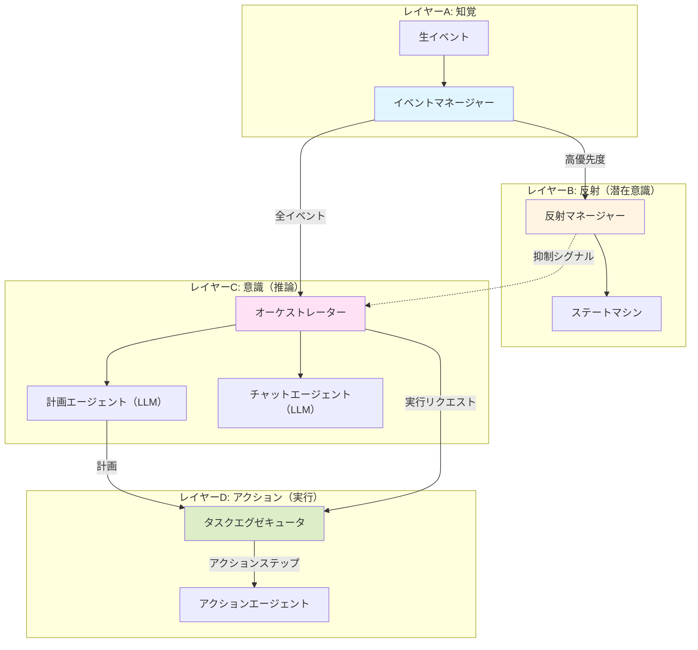

# WIP

**注意: 以下のドキュメントは最新でない可能性があります。**

## 🧠 認知アーキテクチャ

AIRIのMinecraftエージェントは、認知科学にインスパイアされた**4層認知アーキテクチャ**で構築されており、反射的、意識的、かつ物理的に基づいた行動を実現します。

### アーキテクチャ概要



### レイヤーA: 知覚

**場所**: `src/cognitive/perception/`

知覚レイヤーは感覚入力ハブとして機能し、Mineflayerの生シグナルを収集し、イベントレジストリ＋ルールエンジンパイプラインを通じて型付きイベント/シグナルに変換します。

**パイプライン**:
- `events/definitions/*` のイベント定義がMineflayerイベントを正規化された生イベントにバインド。
- `EventRegistry` が `raw:<modality>:<kind>` イベントを認知イベントバスに発行。
- `RuleEngine` がYAMLルールを評価し、反射/意識レイヤーが消費する派生 `signal:*` イベントを発行。

**主要ファイル**:
- `events/index.ts`
- `events/definitions/*`
- `rules/engine.ts`
- `rules/*.yaml`
- `pipeline.ts`

### レイヤーB: 反射

**場所**: `src/cognitive/reflex/`

反射レイヤーは即座の本能的な反応を処理します。予測可能で高速な応答のために有限状態マシン（FSM）パターンで動作します。

**コンポーネント**:
- **反射マネージャー** (`reflex-manager.ts`): 反射行動を調整
- **抑制**: 反射は意識レイヤーの処理を抑制し、冗長な応答を防ぐことができます。

### レイヤーC: 意識

**場所**: `src/cognitive/conscious/`

意識レイヤーは複雑な推論、計画、高レベルの意思決定を処理します。ここでは物理的な実行は行われません。

**コンポーネント**:
- **Brain** (`brain.ts`): イベントキューオーケストレーション、LLMターンライフサイクル、安全性/予算ガード、デバッグREPL統合。
- **JavaScriptプランナー** (`js-planner.ts`): 公開されたツール/グローバルに対するサンドボックス化された計画/ランタイム実行。
- **クエリランタイム** (`query-dsl.ts`): プランナースクリプト用の読み取り専用ワールド/インベントリ/エンティティクエリヘルパー。
- **タスク状態** (`task-state.ts`): アクション実行で使用されるキャンセルトークンとタスクライフサイクルプリミティブ。

### レイヤーD: アクション

**場所**: `src/cognitive/action/`

アクションレイヤーはワールド内でのタスクの実際の実行を担当します。「実行」を「思考」から分離します。

**コンポーネント**:
- **タスクエグゼキュータ** (`task-executor.ts`): 正規化されたアクション命令を実行し、アクションライフサイクルイベントを発行。
- **アクションレジストリ** (`action-registry.ts`): パラメータの検証とツール呼び出しのディスパッチ。
- **ツールカタログ** (`llm-actions.ts`): mineflayerスキルにバインドされたアクション/ツール定義とスキーマ。

### 🔄 イベントフローの例

**シナリオ: 「家を建てて」**
```txt
プレイヤー: 「家を建てて」
  ↓
[知覚] イベント検出
  ↓
[意識] アーキテクトが構造を計画
  ↓
[アクション] エグゼキュータが計画を受け取り、建設ループを管理:
    - ステップ1: 木材を収集（ActionRegistryツールを呼び出し）
    - ステップ2: 板を作成
    - ステップ3: 壁を建設
  ↓
[意識] Brainが完了を確認:「家ができました！」
```

### 📁 プロジェクト構成

```txt
src/
├── cognitive/                  # 🧠 知覚 → 反射 → 意識 → アクション
│   ├── perception/            # イベント定義 + ルール評価
│   │   ├── events/
│   │   │   ├── index.ts
│   │   │   └── definitions/*
│   │   ├── rules/
│   │   │   ├── *.yaml
│   │   │   ├── engine.ts
│   │   │   ├── loader.ts
│   │   │   └── matcher.ts
│   │   └── pipeline.ts
│   ├── reflex/                # 高速なルールベース反応
│   │   ├── reflex-manager.ts
│   │   ├── runtime.ts
│   │   ├── context.ts
│   │   └── behaviors/idle-gaze.ts
│   ├── conscious/             # LLM駆動の推論
│   │   ├── brain.ts           # コア推論ループ/オーケストレーション
│   │   ├── js-planner.ts      # JS計画サンドボックス
│   │   ├── query-dsl.ts       # 読み取り専用クエリランタイム
│   │   ├── llm-log.ts         # ターン/ログクエリヘルパー
│   │   ├── task-state.ts      # タスクライフサイクル列挙型/ヘルパー
│   │   └── prompts/           # プロンプト定義（例: brain-prompt.ts）
│   ├── action/                # タスク実行レイヤー
│   │   ├── task-executor.ts   # アクション実行とライフサイクルイベント発行
│   │   ├── action-registry.ts # ツールディスパッチ + スキーマ検証
│   │   ├── llm-actions.ts     # ツールカタログ
│   │   └── types.ts
│   ├── event-bus.ts           # イベントバスコア
│   ├── container.ts           # 依存性注入の配線
│   ├── index.ts               # 認知システムエントリポイント
│   └── types.ts               # 共有認知型
├── libs/
│   └── mineflayer/           # Mineflayerボットラッパー/アダプター
├── skills/                   # アトミックなボット機能
├── composables/              # 再利用可能な関数（設定など）
├── plugins/                  # Mineflayer/ボットプラグイン
├── debug/                    # デバッグWebダッシュボード + MCPブリッジ
├── utils/                    # ヘルパー
└── main.ts                   # ボットエントリポイント
```

### 🎯 設計原則

1. **関心の分離**: 各レイヤーに明確な責務
2. **イベント駆動**: 集中イベントシステムによる疎結合
3. **抑制制御**: 反射が不要なLLM呼び出しを防止
4. **拡張性**: 新しい反射や意識的行動の追加が容易
5. **認知的リアリズム**: 人間のような 知覚 → 反応 → 熟慮 を模倣

### 🚧 今後の拡張予定

- **知覚レイヤー**:
  - ⏱️ 時間的コンテキストウィンドウ（最近のイベントを記憶）
  - 🎯 顕著性検出（ノイズをフィルタリングし、重要なイベントを優先）

- **反射レイヤー**:
  - 🏃 敵対的モブの回避
  - 🛡️ 緊急戦闘対応

- **意識レイヤー**:
  - 💭 感情状態管理
  - 🧠 長期記憶の統合
  - 🎭 パーソナリティ駆動の応答

## 🛠️ 開発

### コマンド

- `pnpm dev` - 開発モードでボットを起動
- `pnpm lint` - ESLintを実行
- `pnpm typecheck` - TypeScript型チェックを実行
- `pnpm test` - テストを実行

## 🙏 謝辞

- https://github.com/kolbytn/mindcraft

## 🤝 コントリビュート

コントリビュート歓迎です！お気軽にPull Requestを送ってください。
