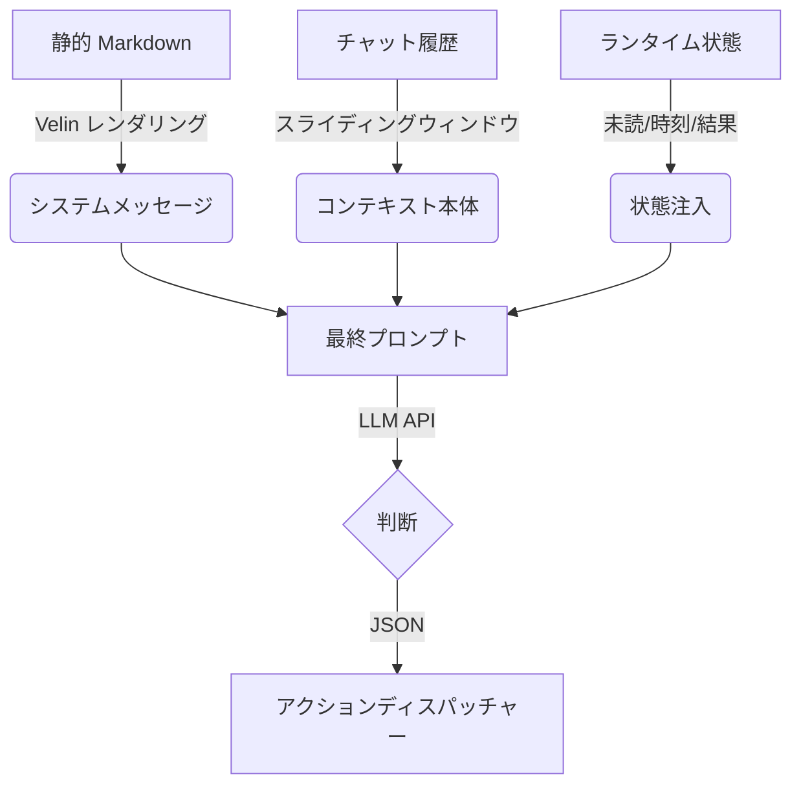

### **プロンプトアーキテクチャ：コンテキスト注入型アクションループ**

Bot は単純なチャット Q&A 構造ではなく、**「状態認識型エージェンティックループ」** を実装しています。プロンプトはループの各ティックで動的に構築されます。

#### **1. 静的レイヤー（システム定義）**

* **ソース:** `src/core/planner/prompts/*.velin.md`
* **ローダー:** `src/core/planner/prompts/index.ts`
* **役割:** 「魂」と「ルール」を定義します。
* **構成要素:**
    * **プロトコル定義（`system-action-gen-v1`）:** 利用可能なツール（`send_message`、`read_unread_messages`、`sleep`）の JSON スキーマとロジックフロー（例：「送信後は未読メッセージを確認する必要がある」）をハードコードします。
    * **ペルソナ（`personality-v1`）:** キャラクター「AIRI」を定義します（トーン、簡潔さ、自然さ）。

#### **2. 履歴レイヤー（短期記憶）**

* **ソース:** インメモリ `messages` 配列（`ChatContext`）。
* **役割:** 会話の継続性を提供します。
* **メカニズム:** 直近 ~20 メッセージのスライディングウィンドウ（ユーザー/アシスタントのターン）がシステムプロンプトの直後に注入されます。

#### **3. 動的状態レイヤー（感覚注入）**

* **ソース:** `src/core/planner/llm-client.ts`（ランタイムで生成）
* **役割:** 「状況認識」と「グラウンディング」を提供します。
* **メカニズム:** 合成された **ユーザーメッセージ** がコンテキストウィンドウの最後に追加され、LLM に即座の現実に集中させます。含まれる内容：
    * **受信ストリーム**: *現在* 到着中の新しいメッセージの生の内容（`scheduler` から渡される）。
    * **アクション履歴**: *直前の* ツール実行結果（例：「アクション: send_message、結果: 成功」）。
    * **環境**: 現在のサーバー時刻。
    * **グローバル状態**: すべてのチャネルにわたる未読メッセージ数の要約（`unreadEvents`）。
    * **トリガー**: 最終指示：*「コンテキストに基づいて... JSON のみでアクションを応答してください。」*

---

### **データフロー概要**

### **主要な特徴**

1. **JSON の強制**: Bot はネイティブの「Function Calling」API（OpenAI Tools など）を使用しません。**プロンプトエンジニアリング** でモデルに生の JSON を出力させ、`best-effort-json-parser` でパースします。
2. **ステートレスロジック**: プロンプトは毎ターン LLM に「X 件の未読メッセージがあります」と明示的に伝え、フロー制御（読み取り vs 返信 vs スリープ）の唯一の意思決定者を LLM にします。
3. **観察-振り返り**: プロンプトに `History actions` が含まれ、LLM が前回の試行結果を「見る」ことができます（例：読み取りアクションが空を返した場合、停止することを知ります）。
